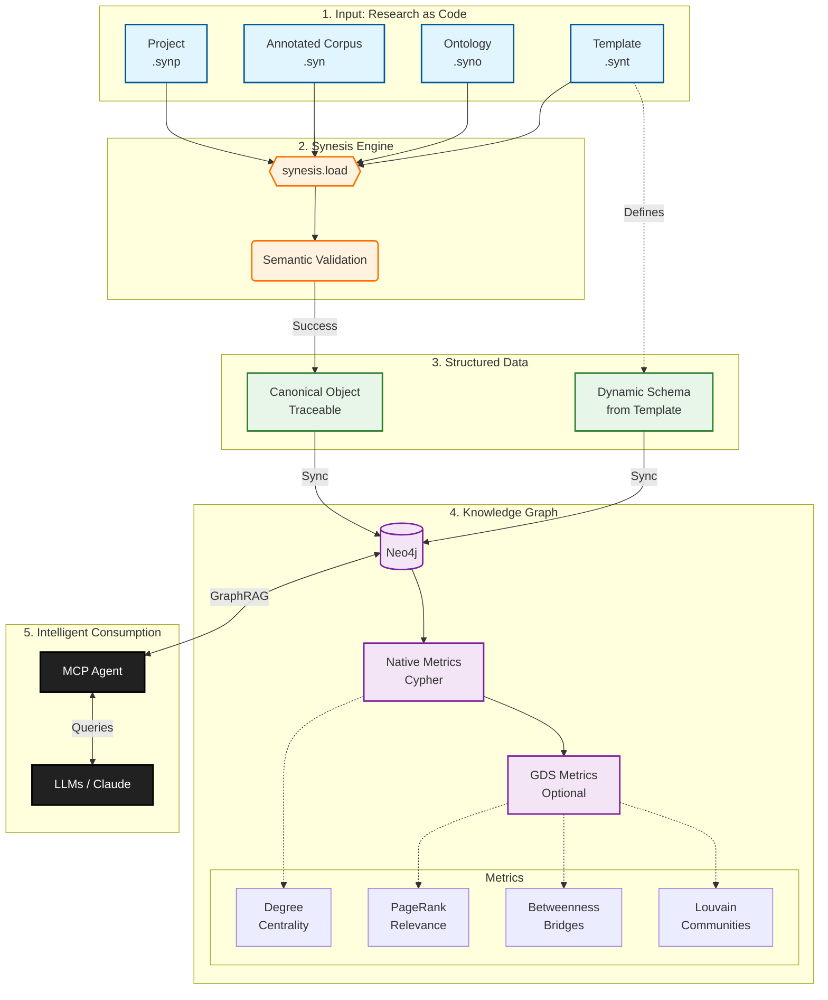

# synesis-graph: Universal Graph Pipeline

[](https://synesis-lang.github.io/synesis-docs)   

> **Transform your qualitative research into a living, navigable Knowledge Graph ready for AI (GraphRAG).**

**Language:** [English](README.md) | [Portugues](README.pt.md)

**Documentation:** [Synesis Language Docs](https://synesis-lang.github.io/synesis-docs)

This repository contains the official pipeline from the **Synesis** language to graph representations. It acts as a bridge between structured human analysis (`.syn` files) and computational intelligence, enabling MCP Agents and Data Science algorithms to interact with your research.

Three backends ship today — **Neo4j** and **ArcadeDB** (property graphs) and **HTML** (self-contained interactive visualization). All are built on the same `BackendAdapter` contract, so support for further graph databases can be added without touching the pipeline.

### Choosing a backend

| | Neo4j | ArcadeDB | HTML |
|---|---|---|---|
| Protocol | BOLT (`bolt://`, port 7687) | HTTP/JSON (`http://`, port 2480) | — |
| Python dependency | `neo4j` driver (extra) | none (stdlib only) | none |
| Server setup | database server | database server | none |
| Graph algorithms | GDS plugin required | built in (`algo.*`) | — |
| Full-text search | Lucene index | Lucene index with BM25 | — |
| License | GPL/commercial | Apache 2.0 | — |

Both database backends produce the **same graph** from the same project: on the
FACE/UFMG corpus every structural count matches (concepts, items, sources and all
relationship types). They differ in how the advanced metrics are scoped — see
[Graph Metrics](#graph-metrics).

---

## Highlights

* **Zero-IO / Direct Link:** Uses the `synesis.load()` API to compile the project in memory and sync directly to the database. No intermediate JSON/CSV files.
* **Universal & Agnostic:** Does not depend on fixed rules (like "Factors" or "Dimensions"). The script reads your **Template (.synt)** and creates the graph structure dynamically.
* **Automatic Metrics:** Calculates network metrics at two levels:
    * **Native Metrics:** Always available via pure Cypher.
    * **GDS Metrics:** Advanced algorithms when the Graph Data Science plugin is installed.
* **Full Traceability:** Every node and edge maintains origin metadata (`source_file`, `line`, `column`), ensuring scientific auditability.

---

## Architecture

The pipeline follows the **"Research as Code"** flow:

1. **Input:** Plain text files (`.syn`, `.syno`, `.synt`, `.synp`) defined by the Synesis language.
2. **Compilation:** The compiler validates syntax and semantics in real-time.
3. **Dynamic Modeling:** The script translates Template definitions into graph structures.
4. **Persistence:** Data is injected into Neo4j via atomic transactions.
5. **Analytics:** Graph metrics are calculated and stored in nodes.

---

## Data Modeling: Template → Graph

The pipeline automatically translates field types defined in your **Template (.synt)** to structures in the Neo4j graph. This translation is dynamic and does not depend on specific field names.

### Mapping Table

| Template Type | Graph Element | Relationship Created | Description |
|---------------|---------------|---------------------|-------------|
| `CODE` | **Concept Node** | `MENTIONS` (Item → Concept) | Central unit of analysis. Node name derived from field (e.g., `ordem_2a` → label `Ordem_2a`). |
| `TOPIC` | **Taxonomy Node** | `GROUPED_BY` | Thematic grouping of concepts. Creates navigable hierarchy. |
| `ASPECT` | **Taxonomy Node** | `QUALIFIED_BY` | Qualitative dimension. Enables multidimensional classification. |
| `DIMENSION` | **Taxonomy Node** | `BELONGS_TO` | High-level aggregate dimension. |
| `ENUMERATED` | **Property** | — | Discrete values stored as node property. |
| `CHAIN` | **Explicit Relationship** | `RELATES_TO` | Direct connection between concepts with type and description. |
| `TEXT` / `MEMO` | **Property** | — | Free text stored as property. |
| `SCOPE SOURCE` | **Source Property** | — | Fields with `SCOPE SOURCE` are dynamically transferred as properties of the `Source` node. |

### Base Nodes (Always Created)

| Node | Description | Properties |
|------|-------------|------------|
| `Source` | Data source (interview, article, document) | `bibtex`, `title`, `author`, `year` + all `SCOPE SOURCE` fields from Template |
| `Item` | Citation unit extracted from source | `item_id`, `citation`, `description` |

### Translation Example

**Template:**
```
FIELD category TYPE CODE
    SCOPE ITEM
END FIELD

FIELD theme TYPE TOPIC
    SCOPE ONTOLOGY
END FIELD
```

**Resulting Graph:**
```
(:Item)-[:MENTIONS]->(:Category)-[:GROUPED_BY]->(:Theme)
```

---

## Graph Metrics

The pipeline automatically calculates network metrics that enrich the analysis. Metrics are divided into two levels:

### Native Metrics (Always Available)

Calculated via pure Cypher, without external dependencies.

#### Concept Nodes (CODE)

| Metric | Description | Analytical Use |
|--------|-------------|----------------|
| `degree` | Total degree (in + out) | Overall concept connectivity |
| `in_degree` | Incoming relationships | Concepts referencing this one |
| `out_degree` | Outgoing relationships | Concepts referenced by this one |
| `mention_count` | Citations mentioning the concept | Frequency in primary data |
| `source_count` | Distinct sources where it appears | Concept dispersion/generalization |

#### Taxonomy Nodes (TOPIC, ASPECT, DIMENSION)

| Metric | Description | Analytical Use |
|--------|-------------|----------------|
| `concept_count` | Concepts classified in this category | Category coverage |
| `weighted_degree` | Sum of IS_LINKED_TO connection weights | Inter-taxonomy relationship strength |
| `aspect_diversity` | Distinct aspects of child concepts | Qualitative diversity |
| `dimension_diversity` | Distinct dimensions of child concepts | Dimensional dispersion |

#### Source Nodes

| Metric | Description | Analytical Use |
|--------|-------------|----------------|
| `item_count` | Citations extracted from source | Source data volume |
| `concept_count` | Distinct concepts mentioned | Source conceptual richness |

### Advanced Metrics

The same three metrics are produced by both database backends, from different engines:

| Backend | Engine | Requires |
|---|---|---|
| Neo4j | Graph Data Science (`gds.*`) | GDS plugin |
| ArcadeDB | built-in algorithms (`algo.*`) | nothing |

**The scores are not directly comparable between the two.** Neo4j's GDS projects only
the concept subgraph (concepts and their `RELATES_TO` edges), while ArcadeDB's `algo.*`
procedures run over the whole graph and accept no scope filter — so `MENTIONS`,
`GROUPED_BY` and the other edges contribute as well. Concepts cited by many items rank
higher under ArcadeDB. On the FACE/UFMG corpus the two top-10 PageRank lists overlap by
6 of 10 entries. Both are valid centralities; they answer slightly different questions.

Values are written only onto concept nodes in both cases. The pipeline prints this
caveat on every ArcadeDB export.

#### Neo4j (GDS)

When the **Neo4j Graph Data Science** plugin is installed, the pipeline calculates advanced network metrics:

| Metric | Algorithm | Description |
|--------|-----------|-------------|
| `pagerank` | PageRank | Connection-based relevance/centrality |
| `betweenness` | Betweenness Centrality | "Bridge" role between clusters |
| `community` | Louvain | Thematic community detection |

#### Graph Projection Strategies

GDS metrics calculation automatically adapts to template type:

| Strategy | When Used | Description |
|----------|-----------|-------------|
| **RELATES_TO** | Templates with `CHAIN` | Uses explicit relationships between concepts |
| **CO_TAXONOMY** | Templates with `CODE` + `TOPIC` | Connects concepts sharing taxonomy |
| **CO_CITATION** | Fallback | Connects concepts co-occurring in same sources |

> **Note:** If GDS is not installed, the pipeline displays a warning and continues normally with native metrics.

#### ArcadeDB (built-in)

ArcadeDB ships a native algorithm library, so no plugin is involved and there is no
degraded path: `pagerank`, `betweenness` and `community` are always computed. Graph
projection strategies do not apply — the algorithms always see the full graph.

---

## Semantic Search with Vector Embeddings (ArcadeDB)

Full-text search finds concepts that *share words* with the question. Vector search
finds concepts that *mean* what the question means. The two are complementary, and
ArcadeDB indexes both on the same node.

```bash
pip install "synesis-graph[embeddings]"

synesis-graph arcadedb --project ./analysis.synp \
    --vector-embeddings ontology_description,topic
```

### What it buys you

Measured on the FACE/UFMG corpus (210 concepts, Portuguese), with five questions
whose vocabulary is deliberately disjoint from the concept descriptions:

| Question | Full-text (BM25) | Vector |
|---|---|---|
| "quem manda nas decisões da empresa" | `jogo_de_empresa` ❌ | **`decisões_estratégicas`** ✅ |
| "empresas endividadas com risco financeiro" | `crescimento_da_empresa` ❌ | **`endividamento_empresarial`** ✅ |
| "diferenças economicas entre regiões do país" | `setor_externo` ❌ | **`agravamento_das_disparidades_regionais`** ✅ |
| "como as pessoas decidem errado por vieses" | `processo_de_tomada_de_decisão` ~ | **`vieses_cognitivos`** ✅ |

The vector search returns the exact concept in 4 of 5; BM25 in none. This is the
GraphRAG case: the researcher asks in their own words, not in the ontology's
controlled vocabulary. Keep the full-text index — it still wins when the term
*is* present.

### Which fields to embed

Fields are validated against your template. The rule follows the declared `TYPE`:

| Type | Embedded? | Why |
|---|---|---|
| `TEXT` | ✅ | The prose that defines the concept |
| `TOPIC` | ✅ | Situates it in a semantic field the question evokes |
| `ORDERED`, `ENUMERATED`, `SCALE` | ⚠️ warns | Closed vocabulary: every concept sharing a value contributes identical text |
| any constant field | ❌ skipped | One distinct value across the corpus discriminates nothing |

The concept name is always included. Not every `TEXT` field is a good choice: a
field holding the *reason* for a classification describes the criterion, not the
concept, and bipolar fields (`Low_Cost`/`High_Cost`) put antonyms in one vector.

### Choosing a model

Per project, in `config.toml` — a Portuguese corpus and an English one have
different needs:

```toml
[arcadedb.embeddings]
model = "sentence-transformers/paraphrase-multilingual-MiniLM-L12-v2"
fields = ["ontology_description", "topic"]
```

| Model | Dims | When |
|---|---|---|
| `paraphrase-multilingual-MiniLM-L12-v2` | 384 | **Default** — Portuguese and multilingual (~470 MB) |
| `all-MiniLM-L6-v2` | 384 | English corpora; smallest (~90 MB) |
| `all-mpnet-base-v2` | 768 | English, quality over speed |
| `cnmoro/portuguese-bge-m3` | 1024 | Portuguese, recall over latency (~1.2 GB) |

**Multilingual is a requirement, not a preference, for Portuguese corpora.** On the
question above most dependent on Portuguese semantics, the English-only model
returned `jogo_de_empresa` — reproducing exactly the lexical error BM25 makes.

### Caching

Vectors are written to `<project>.embeddings.json` (add it to `.gitignore`; it is
2.5 MB for 210 concepts). Only concepts whose text changed are recomputed, and a
fully cached run does not load the model at all — 11s cold, 1s warm on face85.

Changing the model or the field list invalidates every vector, by design: vectors
from different models are individually valid and mutually meaningless. Use
`--rebuild-embeddings` to force a full recompute.

### Querying

```sql
SELECT expand(vector.neighbors('Chain[embedding]', <query_vector>, 5))
```

> **Note:** ArcadeDB stores and searches vectors but does not generate them —
> that is what the `[embeddings]` extra is for. The Neo4j backend does not
> support vectors in this version.

### Case studies

Two real corpora, embedded and queried end to end, showing the model choice is a
per-project decision rather than a fixed default.

| | FACE/UFMG (face85) | Social_Acceptance |
|---|---|---|
| Language | Portuguese | English |
| Concepts | 210 | 1388 |
| Model | `paraphrase-multilingual-MiniLM-L12-v2` (384d) | `all-mpnet-base-v2` (768d) |
| Fields | `ontology_description`, `topic` | `ontology_description`, `topic` |
| Generation time (cold) | 10 s | 116 s |
| Sidecar size | 2.5 MB | 32.5 MB |

```bash
cd face85 && synesis-graph arcadedb --project face85.synp \
    --vector-embeddings ontology_description,topic

cd Social_Acceptance && synesis-graph arcadedb --project social_acceptance.synp \
    --vector-embeddings ontology_description,topic
```

Querying each database with `vector.neighbors`:

```
face85, "quem manda nas decisões da empresa" (no shared word with any description):
    decisões_estratégicas       0.3288
    governança_corporativa      0.3871
    desempenho_organizacional   0.4291

Social_Acceptance, "why do people distrust offshore wind energy projects":
    Industry_Attitude           0.3451
    Preference_Misalignment     0.3529
    Offshore_Wind               0.3615
```

`all-mpnet-base-v2` was chosen over the smaller `all-MiniLM-L6-v2` for
Social_Acceptance because the corpus is large and English-only, so the extra
768-dimension quality is worth the slower encode — the tradeoff table above lets
you make the opposite call for a corpus where speed matters more.

---

## Installation

Requires **Python 3.10+** and [synesis](https://github.com/synesis-lang/synesis) ≥ 0.10.0.

```bash
# Clone the repository
git clone https://github.com/synesis-lang/synesis-graph.git
cd synesis-graph

# Install (editable) with the graph backends you need
pip install -e ".[neo4j]"

# The ArcadeDB and HTML backends need no extra — they use only the standard library
pip install -e .
```

### Compatibility matrix

| Package | This version | Requires `synesis` | Python |
|---|---|---|---|
| synesis | 0.11.0 | — | ≥3.10 |
| synesis-coder | 0.8.0 | ≥0.10.0 | ≥3.10 |
| synesis-lsp | 0.22.0 | ≥0.10.0 | ≥3.10 |
| synesis-graph | 0.6.0 | ≥0.10.0 | ≥3.10 |

### GDS Plugin (Optional)

For advanced metrics, install the [Neo4j Graph Data Science](https://neo4j.com/docs/graph-data-science/current/installation/):

```bash
# Neo4j Desktop: Plugins → Install Graph Data Science Library
# Neo4j Server: Download JAR and add to plugins/ directory
```

---

## Configuration

Create a `config.toml` file in the root with the credentials of the backend you use:

```toml
[neo4j]
uri = "bolt://localhost:7687"  # Or your Neo4j Aura URI
user = "neo4j"
password = "your_secret_password"
database = "neo4j"             # Optional, default is 'neo4j'

[arcadedb]
uri = "http://localhost:2480"  # HTTP endpoint — NOT a bolt:// URL
user = "root"
password = "your_secret_password"
# database = "my_corpus"       # Optional, derived from the project name
# fulltext_analyzer = "brazilian"
```

Both blocks may coexist; each backend reads only its own. See `config.toml.example`
for every option.

---

## Usage

Pick a backend and point it at the Synesis project file (`.synp`):

```bash
# Sync to Neo4j
synesis-graph neo4j --project ./my-project/analysis.synp

# Sync to ArcadeDB
synesis-graph arcadedb --project ./my-project/analysis.synp

# Render a self-contained interactive HTML graph
synesis-graph html --project ./my-project/analysis.synp --output graph.html

# See every backend and its options
synesis-graph --help
```

### What happens during execution?

1. **Compilation:** The Synesis compiler validates your code. Syntax errors are displayed and the process stops (the destination is not touched).
2. **Connection:** If compilation succeeds, the pipeline connects to the selected backend.
3. **Constraints:** Uniqueness rules are applied based on the Template.
4. **Synchronization:** Data is injected (Concepts, Citations, Sources, Relationships).
5. **Native Metrics:** Calculated via pure Cypher.
6. **Advanced Metrics:** GDS on Neo4j (with a warning if the plugin is absent), built-in `algo.*` on ArcadeDB (always available).

---

## Resulting Graph Structure

### Main Relationships

| Relationship | Source | Target | Description |
|--------------|--------|--------|-------------|
| `FROM_SOURCE` | Item | Source | Citation traceability |
| `MENTIONS` | Item | Concept | Citation mentions concept |
| `GROUPED_BY` | Concept | Topic | Thematic classification |
| `QUALIFIED_BY` | Concept | Aspect | Dimensional qualification |
| `BELONGS_TO` | Concept | Dimension | High-level aggregation |
| `RELATES_TO` | Concept | Concept | Explicit relationship (CHAIN) |
| `IS_LINKED_TO` | Topic | Topic | Weighted co-taxonomy |

### Cypher Query Example

```cypher
// Find the 10 most central concepts
MATCH (c:Concept)
WHERE c.pagerank IS NOT NULL
RETURN c.name, c.pagerank, c.mention_count, c.community
ORDER BY c.pagerank DESC
LIMIT 10

// Explore thematic communities
MATCH (c:Concept)
WHERE c.community = 42
RETURN c.name, c.pagerank
ORDER BY c.pagerank DESC
```

---

## MCP Agent Integration (AI)

Once your data is in Neo4j, you can use the **Neo4j MCP Server** to allow LLMs (like Claude Desktop or Cursor) to converse with your research.

### Quick Installation

```bash
# Install uv (if needed)
pip install uv
```

### Claude Desktop Configuration

Add to `claude_desktop_config.json`:

```json
{
  "mcpServers": {
    "synesis-neo4j": {
      "command": "uvx",
      "args": ["mcp-neo4j-cypher@0.5.2", "--read-only"],
      "env": {
        "NEO4J_URI": "bolt://localhost:7687",
        "NEO4J_USERNAME": "neo4j",
        "NEO4J_PASSWORD": "your_password",
        "NEO4J_DATABASE": "database_name"
      }
    }
  }
}
```

**File location:**
- Windows: `%APPDATA%\Claude\claude_desktop_config.json`
- macOS: `~/Library/Application Support/Claude/claude_desktop_config.json`

### Question Examples

| Question | Returns |
|----------|---------|
| "Which concepts have the highest PageRank?" | Top concepts by relevance |
| "Show sources mentioning 'Acceptance'" | Item → Source traceability |
| "Which concepts belong to community 1?" | Cluster analysis |
| "Compare metrics of main concepts" | Comparative table |

### Complete Documentation

See the `mcp/` folder for:
- [SETUP.en.md](mcp/SETUP.en.md) - Complete configuration guide
- [QUERIES_REFERENCE.en.md](mcp/QUERIES_REFERENCE.en.md) - Cypher query reference
- Configuration templates for single and multiple databases

---

## Flow Diagram



---

## License

This program is distributed under the **GNU Affero General Public License,
version 3 only (AGPL-3.0-only), with the Synesis Data-Output Exception** — see
[LICENSE](LICENSE) and [LICENSE.exception](LICENSE.exception).

SPDX identifier: `AGPL-3.0-only AND LicenseRef-Synesis-data-output-exception`

**The graphs you generate are yours.** Exported artifacts — Cypher scripts,
Neo4j databases, and the standalone HTML visualization — are **not** covered by
the AGPL and carry no copyleft obligation toward Synesis.

This matters especially here: the generated HTML **embeds Synesis's own
JavaScript and CSS** so the visualization can render standalone. That embedded
material is *Synesis Runtime Material* under the Exception, and it does **not**
place the generated file under the AGPL. You may publish, sell, or license the
HTML you generate under any terms you choose.

The AGPL applies to synesis-graph itself: if you modify it and distribute it,
or run it as a network service, you must share your changes under the AGPL.

Releases published before this change remain available under the MIT license
they were issued under.

This license grants no rights to the "Synesis" name or logo.

---

Part of the **[Synesis Language](https://synesis-lang.github.io/synesis-docs)** ecosystem.
