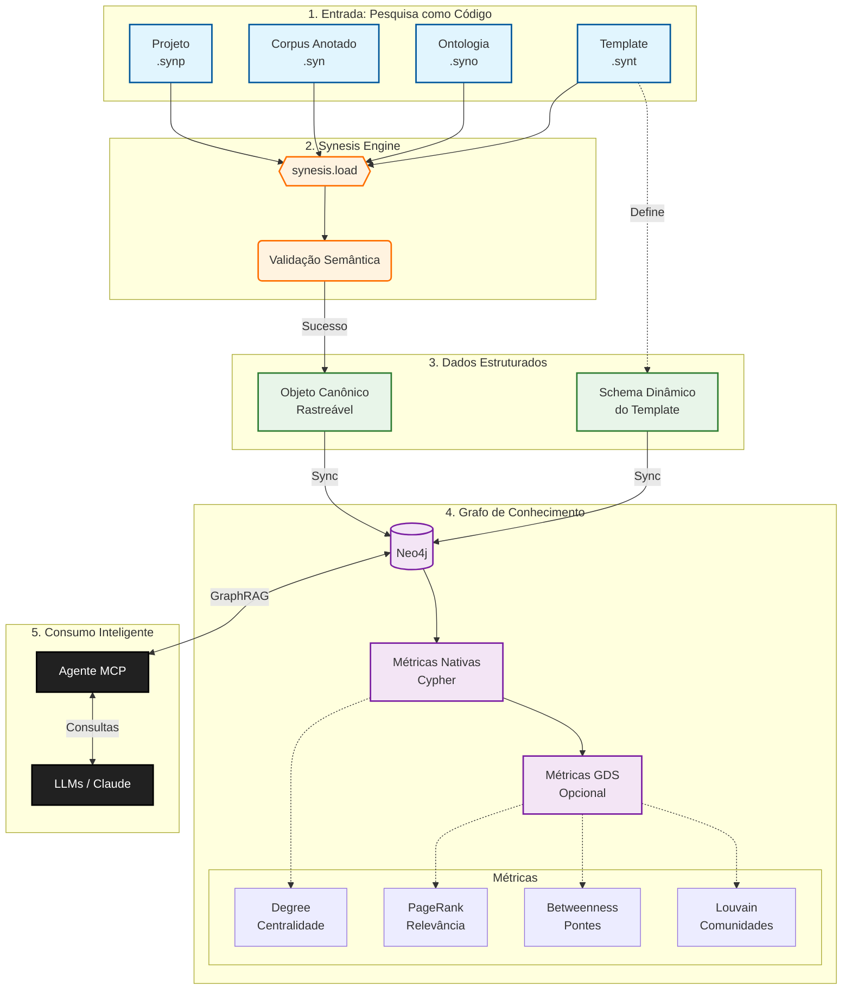

# synesis-graph: Pipeline Universal de Grafos

[](https://synesis-lang.github.io/synesis-docs)   

> **Transforme sua pesquisa qualitativa em um Grafo de Conhecimento vivo, navegável e pronto para IA (GraphRAG).**

**Idioma:** [English](README.md) | [Português](README.pt.md)

**Documentação:** [Synesis Language Docs](https://synesis-lang.github.io/synesis-docs)

Este repositório contém o pipeline oficial da linguagem **Synesis** para representações em grafo. Ele atua como uma ponte entre a análise humana estruturada (arquivos `.syn`) e a inteligência computacional, permitindo que Agentes MCP e algoritmos de Data Science interajam com sua pesquisa.

Três backends acompanham esta versão — **Neo4j** e **ArcadeDB** (property graphs) e **HTML** (visualização interativa autocontida). Todos são construídos sobre o mesmo contrato `BackendAdapter`, então o suporte a outros bancos de grafos pode ser acrescentado sem tocar no pipeline.

### Escolhendo um backend

| | Neo4j | ArcadeDB | ArcadeDB embedded | HTML |
|---|---|---|---|---|
| Protocolo | BOLT (`bolt://`, porta 7687) | HTTP/JSON (`http://`, porta 2480) | in-process | — |
| Extra a instalar | driver `neo4j` | nenhum | nenhum | nenhum |
| Infraestrutura | servidor de banco | servidor de banco | **nenhuma** | nenhuma |
| Exige Java | sim (servidor) | sim (servidor) | **não** (JVM embutida) | — |
| Compartilhável entre pessoas | sim | sim | não (processo único) | — |
| Algoritmos de grafo | exige plugin GDS | nativos (`algo.*`) | nativos (`algo.*`) | — |
| Busca full-text | índice Lucene | índice Lucene com BM25 | índice Lucene com BM25 | — |
| Licença | GPL/comercial | Apache 2.0 | Apache 2.0 | — |

Os três backends de banco produzem o **mesmo grafo** a partir do mesmo projeto. No
corpus FACE/UFMG todas as contagens estruturais coincidem entre Neo4j e ArcadeDB; no
corpus Quinto_Andar (41.474 itens, 7.293 conceitos, 661 fontes) o backend embedded
reproduz a exportação do Neo4j Aura nas 16 contagens de nós e relações. Diferem no
escopo das métricas avançadas — veja [Métricas de Grafo](#métricas-de-grafo).

**`arcadedb` ou `arcadedb-embedded`?** Mesmo motor, entregas diferentes. Use o backend
de servidor quando várias pessoas compartilham um grafo, ou quando algo remoto precisa
alcançá-lo. Use o embedded para trabalhar sozinho: não há nada a instalar além do `pip`,
nada a iniciar antes de trabalhar, e o grafo é um diretório que se copia ou se apaga. A
Fase B abaixo transforma esse diretório em algo que um cliente de chat consulta, ainda
sem servidor a administrar.

---

## Destaques

* **Zero-IO / Direct Link:** Utiliza a API `synesis.load()` para compilar o projeto em memória e sincronizar diretamente com o banco. Sem arquivos JSON/CSV intermediários.
* **Universal & Agnóstico:** Não depende de regras fixas (como "Fatores" ou "Dimensões"). O script lê o seu **Template (.synt)** e cria a estrutura do grafo dinamicamente.
* **Métricas Automáticas:** Calcula métricas de rede em dois níveis:
    * **Métricas Nativas:** Sempre disponíveis via Cypher puro.
    * **Métricas GDS:** Algoritmos avançados quando o plugin Graph Data Science está instalado.
* **Grafos que se descrevem:** Todo sync grava um vértice `ProjectContext` com a semântica do seu template — descrições de campo, escalas de valores e **GUIDELINES** — para que qualquer consumidor do grafo, do Claude Desktop a qualquer cliente MCP, saiba o que os dados *significam*.
* **Rastreabilidade Total:** Cada nó e aresta mantém metadados de origem (`source_file`, `line`, `column`), garantindo auditabilidade científica.

---

## Arquitetura

O pipeline segue o fluxo **"Research as Code"**:

1.  **Entrada:** Arquivos de texto plano (`.syn`, `.syno`, `.synt`, `.synp`) definidos pela linguagem Synesis.
2.  **Compilação:** O compilador valida a sintaxe e a semântica em tempo real.
3.  **Modelagem Dinâmica:** O script traduz definições do Template em estruturas de grafo.
4.  **Persistência:** Os dados são injetados no Neo4j via transações atômicas.
5.  **Analytics:** Métricas de grafo são calculadas e armazenadas nos nós.

---

## Modelagem de Dados: Template → Grafo

O pipeline traduz automaticamente os tipos de campo definidos no seu **Template (.synt)** para estruturas no grafo Neo4j. Esta tradução é dinâmica e não depende de nomes específicos de campos.

### Tabela de Mapeamento

| Tipo no Template | Elemento no Grafo | Relação Criada | Descrição |
|------------------|-------------------|----------------|-----------|
| `CODE` | **Nó Conceito** | `MENTIONS` (Item → Conceito) | Unidade central de análise. Nome do nó derivado do campo (ex: `ordem_2a` → label `Ordem_2a`). |
| `TOPIC` | **Nó Taxonomia** | `GROUPED_BY` | Agrupamento temático de conceitos. Cria hierarquia navegável. |
| `ASPECT` | **Nó Taxonomia** | `QUALIFIED_BY` | Dimensão qualitativa. Permite classificação multidimensional. |
| `DIMENSION` | **Nó Taxonomia** | `BELONGS_TO` | Dimensão agregada de alto nível. |
| `ENUMERATED` | **Propriedade** | — | Valores discretos armazenados como propriedade no nó. |
| `CHAIN` | **Relação Explícita** | `RELATES_TO` | Conexão direta entre conceitos com tipo e descrição. |
| `TEXT` / `MEMO` | **Propriedade** | — | Texto livre armazenado como propriedade. |
| `SCOPE SOURCE` | **Propriedade de Source** | — | Campos com `SCOPE SOURCE` são transferidos dinamicamente como propriedades do nó `Source`. |

### Nós Base (Sempre Criados)

| Nó | Descrição | Propriedades |
|----|-----------|--------------|
| `Source` | Fonte de dados (entrevista, artigo, documento) | `bibtex`, `title`, `author`, `year` + todos os campos `SCOPE SOURCE` do Template |
| `Item` | Unidade de citação extraída da fonte | `item_id`, `citation`, `description` |

### Exemplo de Tradução

**Template:**
```
FIELD categoria TYPE CODE
    SCOPE ITEM
END FIELD

FIELD tema TYPE TOPIC
    SCOPE ONTOLOGY
END FIELD
```

**Grafo Resultante:**
```
(:Item)-[:MENTIONS]->(:Categoria)-[:GROUPED_BY]->(:Tema)
```

---

## Grafos que se descrevem: `ProjectContext`

Todo sync para um backend de banco grava um vértice `ProjectContext` com o
contexto do próprio projeto. **O contexto viaja com os dados, não com a
ferramenta.**

Sem ele, o grafo exportado é *sintaxe sem semântica*. Um consumidor que faça
introspecção do schema descobre que o vértice `Aspect` tem uma propriedade
`name` — mas não que `Aspect` é a escala modal de Dooyeweerd, que seus valores
são **ordenados**, nem o que significa `[15] Fiducial`. Tudo isso está declarado
no seu template, e era descartado na exportação.

### O que ele guarda

| Propriedade | Conteúdo |
|---|---|
| `description` | o bloco `DESCRIPTION` do seu `.synp`, literal |
| `project_summary` | metadados, tamanho do corpus e proveniência, em prosa |
| `template_doc` | o template como documento legível — cada campo com tipo, escopo, descrição, escala de valores e **GUIDELINES**, mais as regras de preenchimento e uma seção `## Como navegar o grafo` que nomeia cada aresta com sua direção |
| `source_count`, `item_count`, `concept_count` | inteiros, consultáveis sem parse |
| `compiler_version`, `synesis_graph_version`, `compiled_at`, `generated_at` | proveniência |

### Por que isso importa

**Responde perguntas que nenhum schema responde.** As `GUIDELINES` que você
escreveu para cada campo são o seu **protocolo de codificação** — as regras de
decisão e os exemplos que dizem o que conta como instância válida de um campo. Um
assistente que as lê deixa de inferir seu critério a partir dos dados e passa a
*conhecê-lo*.

**É derivado, nunca fixado em código.** Dois projetos com templates diferentes
produzem documentos diferentes: um pode ter `aspect` numa escala filosófica de 16
valores, outro `categoria_resultado` com vocabulário próprio. Nada aqui presume
as palavras de um projeto.

**Não diverge em silêncio.** Ambos os backends limpam o grafo antes de
sincronizar, então o contexto descreve sempre *aquele* snapshot. O
`generated_at` permite ao consumidor dizer "este grafo tem três meses" em vez de
apresentar dado velho como atual.

**É Markdown, não JSON.** Medido por um cliente MCP real: como JSON, as
especificações de campo chegavam com ~7,3 mil tokens e 53% das chaves valendo
`null`, e as GUIDELINES — que você escreveu com títulos e quebras de linha — vinham
escapadas dentro de uma string. Prosa é menor, dispensa parse e preserva a forma
que você deu.

### Como ler

```cypher
// Orientação barata: do que trata este grafo, e qual seu tamanho?
MATCH (p:ProjectContext) RETURN p.description, p.project_summary

// A semântica completa do template, quando a pergunta exigir
MATCH (p:ProjectContext) RETURN p.template_doc
```

Backends: **ArcadeDB** e **Neo4j**. O backend HTML fica de fora — é artefato de
visualização, sem consumidor programático, e para quem lê na tela o contexto já
está implícito.

Um grafo gerado por versão anterior simplesmente não tem esse vértice; o
consumidor deve tratar a ausência como "sem contexto disponível", não como erro.

---

## Métricas de Grafo

O pipeline calcula automaticamente métricas de rede que enriquecem a análise. As métricas são divididas em dois níveis:

### Métricas Nativas (Sempre Disponíveis)

Calculadas via Cypher puro, sem dependências externas.

#### Nós de Conceito (CODE)

| Métrica | Descrição | Uso Analítico |
|---------|-----------|---------------|
| `degree` | Grau total (in + out) | Conectividade geral do conceito |
| `in_degree` | Relações recebidas | Conceitos que referenciam este |
| `out_degree` | Relações emitidas | Conceitos referenciados por este |
| `mention_count` | Citações que mencionam o conceito | Frequência nos dados primários |
| `source_count` | Fontes distintas onde aparece | Dispersão/generalização do conceito |

#### Nós de Taxonomia (TOPIC, ASPECT, DIMENSION)

| Métrica | Descrição | Uso Analítico |
|---------|-----------|---------------|
| `concept_count` | Conceitos classificados nesta categoria | Abrangência da categoria |
| `weighted_degree` | Soma dos pesos das conexões IS_LINKED_TO | Força das relações inter-taxonomia |
| `aspect_diversity` | Aspectos distintos dos conceitos filhos | Diversidade qualitativa |
| `dimension_diversity` | Dimensões distintas dos conceitos filhos | Dispersão dimensional |

#### Nós de Source

| Métrica | Descrição | Uso Analítico |
|---------|-----------|---------------|
| `item_count` | Citações extraídas da fonte | Volume de dados da fonte |
| `concept_count` | Conceitos distintos mencionados | Riqueza conceitual da fonte |

### Métricas Avançadas

As mesmas três métricas são produzidas pelos dois backends de banco, por motores diferentes:

| Backend | Motor | Exige |
|---|---|---|
| Neo4j | Graph Data Science (`gds.*`) | plugin GDS |
| ArcadeDB | algoritmos nativos (`algo.*`) | nada |

**Os scores não são diretamente comparáveis entre os dois.** O GDS do Neo4j projeta
apenas o subgrafo de conceitos (conceitos e suas arestas `RELATES_TO`), enquanto os
procedimentos `algo.*` do ArcadeDB rodam sobre o grafo inteiro e não aceitam filtro de
escopo — então `MENTIONS`, `GROUPED_BY` e as demais arestas também contribuem.
Conceitos citados por muitos itens sobem no ranking do ArcadeDB. No corpus FACE/UFMG os
dois top-10 de PageRank coincidem em 6 de 10 entradas. Ambas são centralidades válidas;
respondem a perguntas ligeiramente diferentes.

Em ambos os casos os valores são gravados apenas nos nós de conceito. O pipeline imprime
essa ressalva a cada exportação para ArcadeDB.

#### Neo4j (GDS)

Quando o plugin **Neo4j Graph Data Science** está instalado, o pipeline calcula métricas avançadas de rede:

| Métrica | Algoritmo | Descrição |
|---------|-----------|-----------|
| `pagerank` | PageRank | Relevância/centralidade baseada em conexões |
| `betweenness` | Betweenness Centrality | Papel de "ponte" entre clusters |
| `community` | Louvain | Detecção de comunidades temáticas |

#### Estratégias de Projeção do Grafo

O cálculo das métricas GDS adapta-se automaticamente ao tipo de template:

| Estratégia | Quando Usada | Descrição |
|------------|--------------|-----------|
| **RELATES_TO** | Templates com `CHAIN` | Usa relações explícitas entre conceitos |
| **CO_TAXONOMY** | Templates com `CODE` + `TOPIC` | Conecta conceitos que compartilham taxonomia |
| **CO_CITATION** | Fallback | Conecta conceitos que co-ocorrem nas mesmas fontes |

> **Nota:** Se o GDS não estiver instalado, o pipeline exibe um aviso e continua normalmente com as métricas nativas.

#### ArcadeDB (nativo)

O ArcadeDB traz uma biblioteca de algoritmos nativa, então não há plugin envolvido nem
caminho degradado: `pagerank`, `betweenness` e `community` são sempre calculados. As
estratégias de projeção não se aplicam — os algoritmos sempre enxergam o grafo completo.

---

## Busca semântica com embeddings vetoriais (ArcadeDB)

A busca full-text encontra conceitos que *compartilham palavras* com a pergunta. A
busca vetorial encontra conceitos que *significam* o que a pergunta significa. As
duas são complementares, e o ArcadeDB indexa ambas no mesmo nó.

```bash
pip install "synesis-graph[embeddings]"

synesis-graph arcadedb --project ./analise.synp \
    --vector-embeddings ontology_description,topic
```

### O ganho medido

Medido no corpus FACE/UFMG (210 conceitos, português), com cinco perguntas cujo
vocabulário é deliberadamente disjunto das descrições:

| Pergunta | Full-text (BM25) | Vetor |
|---|---|---|
| "quem manda nas decisões da empresa" | `jogo_de_empresa` ❌ | **`decisões_estratégicas`** ✅ |
| "empresas endividadas com risco financeiro" | `crescimento_da_empresa` ❌ | **`endividamento_empresarial`** ✅ |
| "diferenças economicas entre regiões do país" | `setor_externo` ❌ | **`agravamento_das_disparidades_regionais`** ✅ |
| "como as pessoas decidem errado por vieses" | `processo_de_tomada_de_decisão` ~ | **`vieses_cognitivos`** ✅ |

O vetor acerta o conceito exato em 4 de 5; o BM25, em nenhuma. É o caso do GraphRAG:
o pesquisador pergunta com as palavras dele, não com o vocabulário controlado da
ontologia. Mantenha o índice full-text — ele continua melhor quando o termo *está*
presente.

### Quais campos entram

Os campos são validados contra o seu template. A regra segue o `TYPE` declarado:

| Tipo | Entra? | Por quê |
|---|---|---|
| `TEXT` | ✅ | A prosa que define o conceito |
| `TOPIC` | ✅ | Situa o conceito no campo semântico que a pergunta evoca |
| `ORDERED`, `ENUMERATED`, `SCALE` | ⚠️ avisa | Vocabulário fechado: todo conceito com o mesmo valor contribui texto idêntico |
| campo constante | ❌ descartado | Um único valor distinto no corpus não discrimina nada |

O nome do conceito entra sempre. Nem todo `TEXT` é boa escolha: um campo com a
*justificativa* de uma classificação descreve o critério, não o conceito, e campos
bipolares (`Low_Cost`/`High_Cost`) colocam antônimos no mesmo vetor.

### Escolha do modelo

Por projeto, no `config.toml` — um corpus em português e um em inglês têm
exigências diferentes:

```toml
[arcadedb.embeddings]
model = "sentence-transformers/paraphrase-multilingual-MiniLM-L12-v2"
fields = ["ontology_description", "topic"]
```

| Modelo | Dims | Quando |
|---|---|---|
| `paraphrase-multilingual-MiniLM-L12-v2` | 384 | **Padrão** — português e multilíngue (~470 MB) |
| `all-MiniLM-L6-v2` | 384 | Corpora em inglês; o menor (~90 MB) |
| `all-mpnet-base-v2` | 768 | Inglês, qualidade acima de velocidade |
| `cnmoro/portuguese-bge-m3` | 1024 | Português, recall acima de latência (~1,2 GB) |

**Para corpora em português, multilíngue é requisito, não preferência.** Na pergunta
acima mais dependente de semântica portuguesa, o modelo só-inglês devolveu
`jogo_de_empresa` — reproduzindo exatamente o erro lexical do BM25.

### Cache

Os vetores vão para `<projeto>.embeddings.json` (coloque no `.gitignore`; são 2,5 MB
para 210 conceitos). Só os conceitos cujo texto mudou são recalculados, e uma
execução totalmente cacheada nem carrega o modelo — 11s a frio, 1s a quente no
face85.

Trocar o modelo ou a lista de campos invalida todos os vetores, por construção:
vetores de modelos diferentes são individualmente válidos e mutuamente
incomparáveis. Use `--rebuild-embeddings` para forçar o recálculo completo.

### Consultando

```sql
SELECT expand(vector.neighbors('Chain[embedding]', <vetor_da_consulta>, 5))
```

> **Nota:** o ArcadeDB armazena e busca vetores, mas não os gera — é para isso que
> serve o extra `[embeddings]`. O backend Neo4j não suporta vetores nesta versão.

### Estudos de caso

Dois corpora reais, embedados e consultados ponta a ponta, mostrando que a escolha
do modelo é decisão por projeto, não um padrão fixo.

| | FACE/UFMG (face85) | Social_Acceptance |
|---|---|---|
| Idioma | Português | Inglês |
| Conceitos | 210 | 1388 |
| Modelo | `paraphrase-multilingual-MiniLM-L12-v2` (384d) | `all-mpnet-base-v2` (768d) |
| Campos | `ontology_description`, `topic` | `ontology_description`, `topic` |
| Tempo de geração (a frio) | 10 s | 116 s |
| Tamanho do sidecar | 2,5 MB | 32,5 MB |

```bash
cd face85 && synesis-graph arcadedb --project face85.synp \
    --vector-embeddings ontology_description,topic

cd Social_Acceptance && synesis-graph arcadedb --project social_acceptance.synp \
    --vector-embeddings ontology_description,topic
```

Consultando cada banco com `vector.neighbors`:

```
face85, "quem manda nas decisões da empresa" (nenhuma palavra em comum com as descrições):
    decisões_estratégicas       0.3288
    governança_corporativa      0.3871
    desempenho_organizacional   0.4291

Social_Acceptance, "why do people distrust offshore wind energy projects":
    Industry_Attitude           0.3451
    Preference_Misalignment     0.3529
    Offshore_Wind               0.3615
```

O `all-mpnet-base-v2` foi escolhido em vez do menor `all-MiniLM-L6-v2` para o
Social_Acceptance porque o corpus é grande e só em inglês, então a qualidade extra
das 768 dimensões compensa o encode mais lento — a tabela de opções acima permite a
escolha oposta para um corpus onde velocidade importa mais.

---

## Instalação

Requer **Python 3.10+** e [synesis](https://github.com/synesis-lang/synesis) ≥ 0.10.0.

```bash
# Clone o repositório
git clone https://github.com/synesis-lang/synesis-graph.git
cd synesis-graph

# Instale (editável) com os backends de grafo que precisar
pip install -e ".[neo4j]"

# Tudo menos o Neo4j funciona de imediato — inclusive o motor de grafo local,
# que traz o próprio Java. Não há mais nada a instalar.
pip install -e .
```

### Matriz de compatibilidade

| Pacote | Esta versão | Requer `synesis` | Python |
|---|---|---|---|
| synesis | 0.11.0 | — | ≥3.10 |
| synesis-coder | 0.8.0 | ≥0.10.0 | ≥3.10 |
| synesis-lsp | 0.22.0 | ≥0.10.0 | ≥3.10 |
| synesis-graph | 0.10.0 | ≥0.10.0 | ≥3.10 |

### Plugin GDS (Opcional)

Para métricas avançadas, instale o [Neo4j Graph Data Science](https://neo4j.com/docs/graph-data-science/current/installation/):

```bash
# Neo4j Desktop: Plugins → Install Graph Data Science Library
# Neo4j Server: Baixe o JAR e adicione ao diretório plugins/
```

---

## Configuração

Crie um arquivo `config.toml` na raiz com as credenciais do backend que você usa:

```toml
[neo4j]
uri = "bolt://localhost:7687"  # Ou seu URI do Neo4j Aura
user = "neo4j"
password = "sua_senha_secreta"
database = "neo4j"             # Opcional, default é 'neo4j'

[arcadedb]
uri = "http://localhost:2480"  # Endpoint HTTP — NÃO é uma URL bolt://
user = "root"
password = "sua_senha_secreta"
# database = "meu_corpus"      # Opcional, derivado do nome do projeto
# fulltext_analyzer = "brazilian"
```

Os dois blocos podem coexistir; cada backend lê apenas o seu. Veja
`config.toml.example` para todas as opções.

---

## Uso

Escolha um backend e aponte para o arquivo de projeto Synesis (`.synp`):

```bash
# Sincroniza com o Neo4j
synesis-graph neo4j --project ./meu-projeto/analise.synp

# Sincroniza com o ArcadeDB
synesis-graph arcadedb --project ./meu-projeto/analise.synp

# Sincroniza com um banco ArcadeDB local — sem servidor, sem porta, sem Java
synesis-graph arcadedb-embedded --project ./meu-projeto/analise.synp

# Gera um grafo HTML interativo e autocontido
synesis-graph html --project ./meu-projeto/analise.synp --output graph.html

# Lista todos os backends e suas opções
synesis-graph --help
```

### O que acontece durante a execução?

1. **Compilação:** O compilador Synesis valida seu código. Erros de sintaxe são exibidos e o processo para (o destino não é tocado).
2. **Conexão:** Se a compilação for bem-sucedida, o pipeline conecta ao backend escolhido.
3. **Constraints:** Regras de unicidade são aplicadas baseadas no Template.
4. **Sincronização:** Dados são injetados (Conceitos, Citações, Fontes, Relações).
5. **Métricas Nativas:** Calculadas via Cypher puro.
6. **Métricas Avançadas:** GDS no Neo4j (com aviso se o plugin não estiver presente), `algo.*` nativo no ArcadeDB (sempre disponível).

---

## Perguntando ao Grafo (`serve`)

Um grafo exportado é um diretório. O `serve` o publica via
[MCP](https://modelcontextprotocol.io), para que o Claude Desktop, o Claude Code
ou a extensão do VSCode consultem o corpus em linguagem natural:

```bash
synesis-graph serve                       # publica ./databases, Ctrl+C encerra
synesis-graph serve --db-path ./grafos    # uma raiz exportada em outro lugar
```

O comando imprime a entrada `mcpServers` a colar na configuração do cliente de
chat. Três coisas que ele resolve e o motor não:

- **O MCP nasce desabilitado** na distribuição embedded, e a configuração vive no
  servidor em execução, não em disco — então é habilitada a cada start.
- **Escritas ficam desligadas** a menos que `--allow-writes` diga o contrário. Um
  corpus são meses de trabalho de codificação, e lê-lo é o caso de uso. Operações
  administrativas seguem bloqueadas de todo modo.
- **A senha é gerada por sessão e impressa, nunca gravada em arquivo.** Defina
  `SYNESIS_DB_PASSWORD` para manter uma entre reinícios e conservar a
  configuração do cliente válida.

Servir uma raiz sem banco algum sob `databases/` é recusado em vez de iniciado:
um servidor sobre o diretório errado sobe tranquilamente e responde toda query
sem nenhuma linha.

---

## Estrutura do Grafo Resultante

### Relações Principais

| Relação | Origem | Destino | Descrição |
|---------|--------|---------|-----------|
| `FROM_SOURCE` | Item | Source | Rastreabilidade da citação |
| `MENTIONS` | Item | Conceito | Citação menciona conceito |
| `GROUPED_BY` | Conceito | Topic | Classificação temática |
| `QUALIFIED_BY` | Conceito | Aspect | Qualificação dimensional |
| `BELONGS_TO` | Conceito | Dimension | Agregação de alto nível |
| `RELATES_TO` | Conceito | Conceito | Relação explícita (CHAIN) |
| `IS_LINKED_TO` | Topic | Topic | Co-taxonomia ponderada |

### Exemplo de Consulta Cypher

```cypher
// Encontrar os 10 conceitos mais centrais
MATCH (c:Conceito)
WHERE c.pagerank IS NOT NULL
RETURN c.name, c.pagerank, c.mention_count, c.community
ORDER BY c.pagerank DESC
LIMIT 10

// Explorar comunidades temáticas
MATCH (c:Conceito)
WHERE c.community = 42
RETURN c.name, c.pagerank
ORDER BY c.pagerank DESC
```

---

## Integração com Agentes MCP (IA)

Uma vez que seus dados estão no Neo4j, você pode utilizar o **Servidor MCP Neo4j** para permitir que LLMs (como Claude Desktop ou Cursor) conversem com sua pesquisa.

### Instalação Rápida

```bash
# Instalar uv (se necessário)
pip install uv
```

### Configuração do Claude Desktop

Adicione ao arquivo `claude_desktop_config.json`:

```json
{
  "mcpServers": {
    "synesis-neo4j": {
      "command": "uvx",
      "args": ["mcp-neo4j-cypher@0.5.2", "--read-only"],
      "env": {
        "NEO4J_URI": "bolt://localhost:7687",
        "NEO4J_USERNAME": "neo4j",
        "NEO4J_PASSWORD": "sua_senha",
        "NEO4J_DATABASE": "nome_do_banco"
      }
    }
  }
}
```

**Localização do arquivo:**
- Windows: `%APPDATA%\Claude\claude_desktop_config.json`
- macOS: `~/Library/Application Support/Claude/claude_desktop_config.json`

### Exemplos de Perguntas

| Pergunta | O que retorna |
|----------|---------------|
| "Quais conceitos têm maior PageRank?" | Top conceitos por relevância |
| "Mostre as fontes que mencionam 'Acceptance'" | Rastreabilidade Item → Source |
| "Quais conceitos pertencem à comunidade 1?" | Análise de clusters |
| "Compare as métricas dos principais conceitos" | Tabela comparativa |

### Documentação Completa

Consulte a pasta `mcp/` para:
- [SETUP.md](mcp/SETUP.md) - Guia completo de configuração
- [QUERIES_REFERENCE.md](mcp/QUERIES_REFERENCE.md) - Referência de queries Cypher
- Templates de configuração para banco único e múltiplo

---

## Diagrama de Fluxo



---

## Licença

Este programa é distribuído sob a **GNU Affero General Public License, versão 3
apenas (AGPL-3.0-only), com a Synesis Data-Output Exception** — veja
[LICENSE](LICENSE) e [LICENSE.exception](LICENSE.exception).

Identificador SPDX: `AGPL-3.0-only AND LicenseRef-Synesis-data-output-exception`

**Os grafos que você gera são seus.** Os artefatos exportados — scripts Cypher,
bases Neo4j e a visualização HTML autocontida — **não** são cobertos pela AGPL
e não carregam nenhuma obrigação de copyleft em relação ao Synesis.

Isso importa especialmente aqui: o HTML gerado **embute JavaScript e CSS do
próprio Synesis** para que a visualização funcione de forma autocontida. Esse
material embutido é *Synesis Runtime Material* nos termos da Exceção e **não**
coloca o arquivo gerado sob a AGPL. Você pode publicar, vender ou licenciar o
HTML que gerar sob os termos que quiser.

A AGPL se aplica ao synesis-graph em si: se você modificá-lo e distribuí-lo, ou
executá-lo como serviço de rede, deve compartilhar suas alterações sob a AGPL.

As versões publicadas antes desta mudança permanecem disponíveis sob a licença
MIT sob a qual foram lançadas.

Esta licença não concede direitos sobre o nome ou logotipo "Synesis".

---

Parte do ecossistema **[Synesis Language](https://synesis-lang.github.io/synesis-docs)**.
